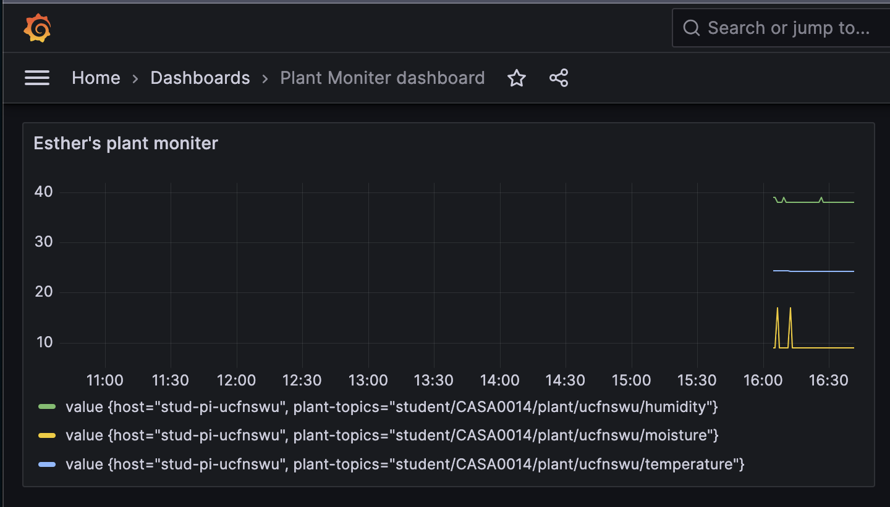

  
# Succulent Monitor
In contrast to the high-maintenance leafy plants, succulents are the low-maintenance rock stars of the botanical world. They can survive on minimal watering, which often leaves us wondering, "Is the soil too dry or just right?"  That's where the sensor system steps in, giving your green pals a voice to tell you,<b> "Hey, it's time for a drink!"  

    
  **🤞🏻Tips to Become Green Finger**  
>🌱 Temperature | </b>15-21°C(60-70°F) is ideal.  
🌱 Position | </b>Stand indoors with good natural light, avoiding the midday sun in summer.  
🌱 Watering | </b>Keep the compost lightly moist, but do not overwater or allow it to stand in water.  

## Board and sensors  
- Feather Huzzah ESP8266 Wi-Fi  
- Raspberry Pi 4
- UCL CASA Plant Monitor Shield
- DHT22: environment temperature, humidity  
- Nail Soil Sensor: soil moisture  

## Process
   
### Build: Setting up environments(Wifi&Time)  
- [Testing](./testwifi_tz) Wi-Fi with ESP8266
- Setting Timezone (GB)
- Solder up CASA Plant Monitor shield
  
### Sensor: Testing sensors and collecting data  
- [Testing](./testDHT22) DHT22 and collecting environment data
- [Testing](./testMoisture) Nail Soil sensor and collecting soil data  
 `(pot size, nails: depth in soil, texture of nails, type of soil, distance between nails)`
 
### Connect: Connecting and publishing data to MQTT  
- [Sending](./testMQTT) Data to MQTT (Publish topics: temperature, humidity, moisture)       
  
  
### Store: Setting up the gateway and storing data  
- Setting up Raspberry Pi as a gateway
- [Install](./testInfluxDB_Telegraf_Grafana) InfluxDB, Telegraf, Grafana
- Setting InfluxDB and Telegraf to capture the data from MQTT topics.
- Create Databases and Raspberry Pi System Dashboard
 `(Token Permission)`
  
### Visualize: Times Series Database Visualization  
- Visualising Data on Grafana
   
  
- Create [testing](./testWeb/webv0.png) web monitor application with HTML, CSS, JavaScript

## What's next?  
>I focus on the connection between plants, people, and sensors (computers).  
>How do we monitor and send data notifications when people and plants are not in the same space?   

In process: 
- [Webhook](./testNotifications) with Arduino: try to interact with the plant (debugging)
- adding speaker/neo pixel with plant
- Interactive website  ([practise](./testWeb/3DWeb))
